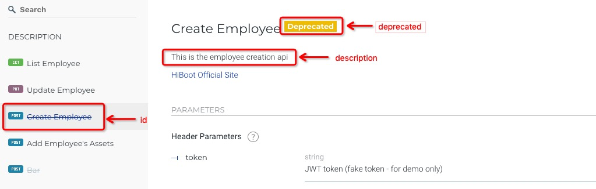
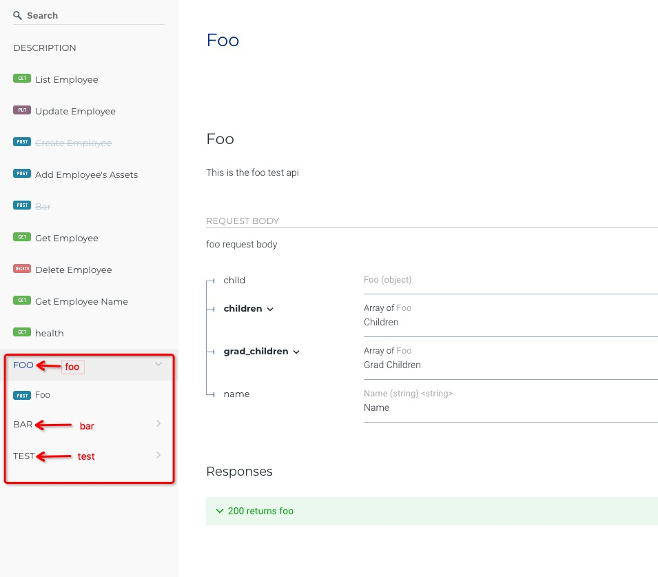
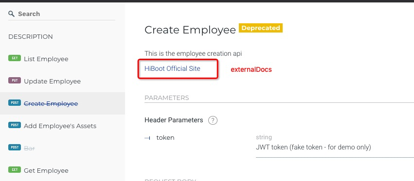
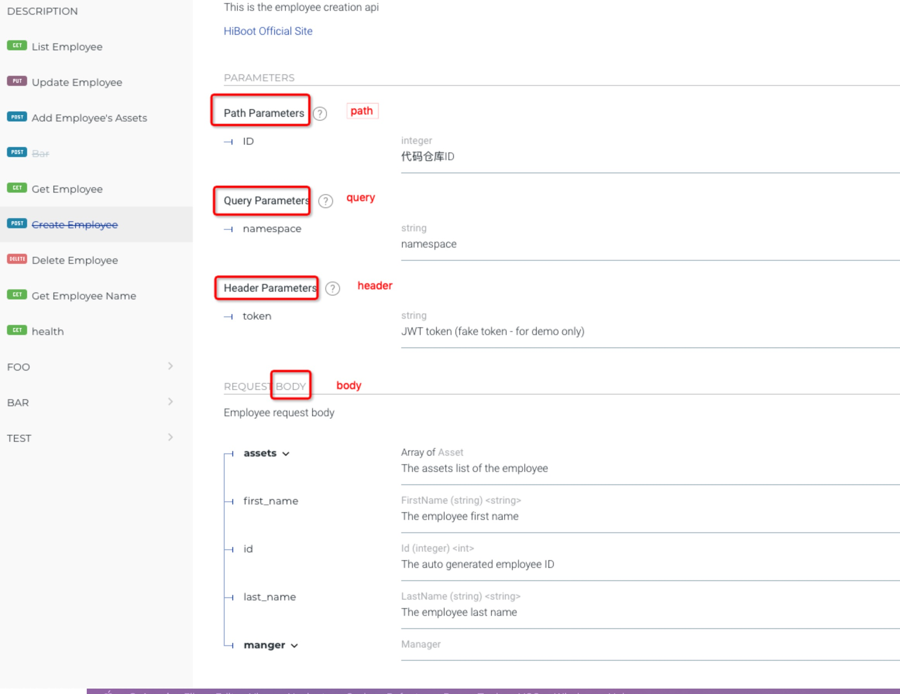
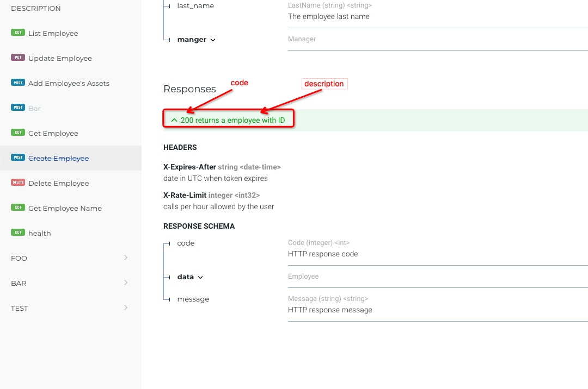
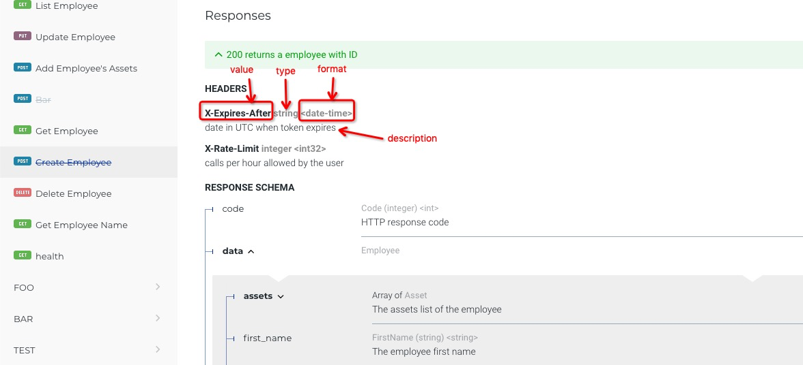

The Hiboot development interface document adopts the OpenAPI standard Swagger2.0. 
The RESTFul style interface document can be written with a few simple annotations. 
When the Hiboot application runs, the interface document will automatically provide 
online GUI documents, such as `http: // hiboot-app .your-domain.com / swagger-ui`.
## Operation

Operation Annotation definition:

```go
type Operation struct {
	Annotation
	Swagger
	AtID string `at:"id" json:"-"`
	AtDescription string `at:"description" json:"-"`
	AtDeprecated bool `at:"deprecated" json:"-"`
}
```

The operation is used to describe an API document, as shown in the figure,
id is used to show the problem of api in the document,
description is used to describe the role of the api
When deprecated is true, the yellow mark of Deprecated is displayed

```go
func (c *) CreateEmployee(at struct{
     at.PostMapping `value:"/"`
     at.Operation   `id:"Create Employee" description:"This is the employee creation api" deprecated:"true"`
   }, request EmployeeRequest) {
}
```



## Tags

Tags Annotation definition:

```go
type Tags struct {
	Annotation
	Swagger
	AtValues []string `at:"values" json:"-"`
}
```

Tags are used to define api grouping

```go
func (c *employeeController) Foo(at struct {
	at.PostMapping `value:"/foo"`
	at.Operation   `id:"Foo" description:"This is the foo test api"`
	at.Consumes    `values:"application/json"`
	at.Produces    `values:"application/json"`
	at.Tags        `values:"foo,bar,test"`
},request *Foo)
```

Values define grouping, separated by commas, one api can define multiple tag tags.



## ExternalDocs

ExternalDocs Annotation definition:

```go
type ExternalDocs struct {
	Annotation
	Swagger
	AtDescription string `at:"description" json:"-"`
	AtURL         string `at:"url" json:"-"`
}
```

url is used to define the URL where the url is redirected, and description is used to describe the description of the url in the document

```go
func (c *employeeController) CreateEmployee(at struct {
	at.PostMapping  `value:"/"`
	at.Operation    `id:"Create Employee" description:"This is the employee creation api" deprecated:"true"`
	at.Consumes     `values:"application/json"`
	at.Produces     `values:"application/json"`
	at.ExternalDocs `url:"http://hiboot.hidevops.io" description:"HiBoot Official Site"`
})
```



## Parameter

Parameter Annotation definition:

```go
type Parameter struct {
	Annotation
	Swagger
	AtName string `at:"name" json:"-"`
	AtType string `at:"type" json:"-"`
	AtIn string `at:"in" json:"-"`
	AtDescription string `at:"description" json:"-"`
}
```

name is used to describe the fields defined in the api, 
description describes the display of the field in the api document,
type describes the type of the field.In has 4 types:
header describes the fields defined in the http header,
body describes the fields defined in the http body,
query describes the key-value pairs defined in the http path,
path describes the fields defined in the path,
As shown below:

```go
func (c *employeeController) CretateEmployee(at struct {
	at.PostMapping  `value:"/{id}"`
	at.ExternalDocs `url:"http://hiboot.hidevops.io" description:"HiBoot Official Site"`
	Parameters      struct {
		Token struct {
			at.Parameter `name:"token" in:"header" type:"string" description:"JWT token (fake token - for demo only)"`
		}
		Body struct {
			at.Parameter `name:"employee" in:"body" description:"Employee request body" `
			CreateEmployeeRequest
		}
		Namespace struct {
			at.Parameter `name:"namespace" type:"string" in:"query" description:"namespace"`
		}
		ID struct {
			at.Parameter `name:"ID" type:"integer" in:"path" description:"代码仓库ID"`
		}
	}
})
```



## Produces

Produces Annotation definition:

```go
type Produces struct{
	Annotation
	Swagger
	AtValues []string `at:"values" json:"-"`
}
```

Produces are used to define the types that the Content-Type field in the request can use.
values can define multiple values, separated by commas.

```go
func (c *employeeController) CreateEmployee(at struct {
	at.PostMapping  `value:"/{id}"`
	at.Operation    `id:"Create Employee" description:"This is the employee creation api" deprecated:"true"`
	at.Consumes     `values:"application/json"`
	at.Produces     `values:"application/json"`
})
```


## Consumes

Consumes Annotation definition:

```go
type Consumes struct{
	Annotation
	Swagger
	AtValues []string `at:"values" json:"-"`
}
```

Produces are used to define the types that the Content-Type field in the response can use.
values can define multiple values, separated by commas.

```go
func (c *employeeController) CreateEmployee(at struct {
	at.PostMapping  `value:"/{id}"`
	at.Operation    `id:"Create Employee" description:"This is the employee creation api" deprecated:"true"`
	at.Consumes     `values:"application/json"`
	at.Produces     `values:"application/json"`
})
```

## Response

Response Annotation definition:

```go
type Response struct {
	Annotation
	Swagger
	AtCode int `at:"code" json:"-"`
	AtDescription string `at:"description" json:"-"`
}
```

code defines the http return code,
description describes the role of code.

```go
func (c *employeeController) CreateEmployee(at struct {
	at.PostMapping  `value:"/{id}"`
	at.Operation    `id:"Create Employee" description:"This is the employee creation api" deprecated:"true"`
	Responses struct {
		StatusOK struct {
			at.Response `code:"200" description:"returns a employee with ID"`
			XRateLimit  struct {
				at.Header `value:"X-Rate-Limit" type:"integer" format:"int32" description:"calls per hour allowed by the user"`
			}
			XExpiresAfter struct {
				at.Header `value:"X-Expires-After" type:"string" format:"date-time" description:"date in UTC when token expires"`
			}
			EmployeeResponse
		}
	}
}
```



## Header

Header Annotation definition:

```go
type Header struct{
	Annotation
	Swagger
	AtType string `at:"type" json:"-"`
	AtFormat string `at:"format" json:"-"`
	AtDescription string `at:"description" json:"-"`
}
```

value defines the header field,
type defines the type of the header field,
format defines the header field format,
description is used to describe the description of the header field in the document

```go
func (c *employeeController) CreateEmployee(at struct {
	at.PostMapping  `value:"/{id}"`
	at.Operation    `id:"Create Employee" description:"This is the employee creation api" deprecated:"true"`
	Responses struct {
		StatusOK struct {
			at.Response `code:"200" description:"returns a employee with ID"`
			XRateLimit  struct {
				at.Header `value:"X-Rate-Limit" type:"integer" format:"int32" description:"calls per hour allowed by the user"`
			}
			XExpiresAfter struct {
				at.Header `value:"X-Expires-After" type:"string" format:"date-time" description:"date in UTC when token expires"`
			}
			EmployeeResponse
		}
	}
}
```


