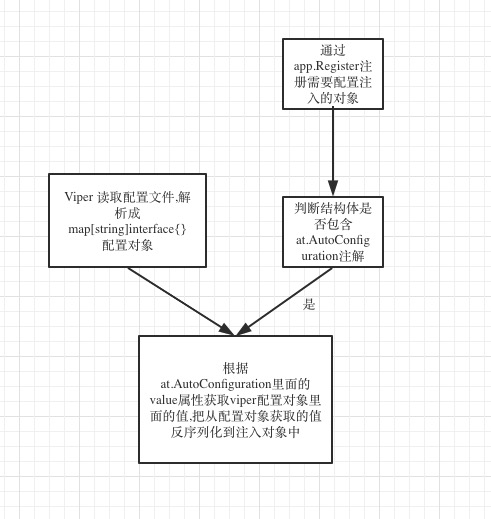

## HiBootApplication
注解定义:
```go
type HiBootApplication struct {
	Annotation
	BaseAnnotation
}
```

## Component
注解定义:
```go
type Component struct {
	Annotation
	BaseAnnotation
}
```

## Conditional
注解定义:
```go
type Conditional struct {
	Annotation
	BaseAnnotation
}
```

## AutoConfiguration
注解定义:
```go
type AutoConfiguration struct {
	Annotation
	BaseAnnotation
}
```

读取配置文件,通过注解的方式将配置文件中的配置注入到结构中。

工作原理:



1 使用viper包读取配置文件,解析成map[string]interface{}
```yaml
actuator:
    enabled: true
```
2 在需要注入配置文件属性的结构体中添加at.AutoConfiguration注解
```go
type configuration struct {
	at.AutoConfiguration
	Properties *properties
}
type properties struct {
	at.ConfigurationProperties `value:"actuator"`
    Enable string `json:"enable"`
}
```
3 注册
```go
func newConfiguration(properties *properties) *configuration {
	return &configuration{Properties: properties}
}

func init() {
	app.Register(newConfiguration, new(properties))
}
```

4 将配置文件的属性注册到properties结构中


## ConfigurationProperties
注解定义:
```go
type ConfigurationProperties struct {
	Annotation
	BaseAnnotation
}
```

定义需要注入配置的属性

```go
type properties struct {
	at.ConfigurationProperties `value:"actuator"`
    Enable string `json:"enable"`
}
```

## ContextAware
注解定义:
```go
type ContextAware struct {
	Annotation
	BaseAnnotation
}
```

在运行时注入依赖
```go
type TokenProperties struct {
	at.ContextAware
	context context.Context
}
```

工作原理:
```go
func (f *configurableFactory) build(cfgContainer []*factory.MetaData) {
	for _, item := range cfgContainer {
		name := f.parseName(item)
		config := item.MetaObject

		isContextAware := annotation.Contains(item.MetaObject, at.ContextAware{})
		if f.systemConfig != nil {
			if !isContextAware &&
				f.systemConfig != nil && !str.InSlice(name, f.systemConfig.App.Profiles.Include) {
				log.Warnf("Auto configuration %v is filtered out! Just ignore this warning if you intended to do so.", name)
				continue
			}
		}
		log.Infof("Auto configuration %v is configured on %v.", item.PkgName, item.Type)
		var cf interface{}
		if item.Kind == types.Func {
			cf, _ = f.InjectIntoFunc(config)
		}
		if cf != nil {
			_ = f.InjectDefaultValue(cf)
			_ = f.InjectIntoObject(cf)
			_ = f.Instantiate(cf)
			configName := name
			f.configurations.Set(configName, cf)
		}
	}
}

```


## HealthCheckService
注解定义:
```go
type HealthCheckService struct {
	Annotation
	BaseAnnotation
}
```

定义健康检查
```go
type HealthCheckService struct {
	at.HealthCheckService
	healthClient pb.HealthClient
}
```

## Middleware
注解定义:
```go
type Middleware struct {
	Annotation
	BaseAnnotation
}
```

用于定义中间件

```go
func (a *application) RegisterController(controller interface{}) error {
	middleware := a.ConfigurableFactory().GetInstances(at.Middleware{})
	controllers := a.ConfigurableFactory().GetInstances(controller)
	if controllers != nil {
		return a.dispatcher.register(controllers, middleware)
	}
	return ErrControllersNotFound
}
func (a *application) Use(handlers ...context.Handler) {
	for _, hdl := range handlers {
		a.webApp.Use(Handler(hdl))
	}
}
```

## MiddlewareHandler
注解定义:
```go
type MiddlewareHandler struct {
	Annotation
	BaseAnnotation
}
```

用于定义中间件的处理

```go
func (d *Dispatcher) parseMiddleware(m *factory.MetaData) (middleware *injectableObject) {
	middleware = new(injectableObject)
	mwi := reflect.ValueOf(m.Instance)
	middleware.object = mwi.Interface()
	annotations := annotation.GetAnnotations(middleware.object)
	middleware.annotations = annotations
	mwType := mwi.Type()
	numOfMethod := mwi.NumMethod()
	for mi := 0; mi < numOfMethod; mi++ {
		methodHandler := new(injectableMethod)
		method := mwType.Method(mi)
		methodHandler.method = &method
		ma := d.parseAnnotation(mi, &method)
		methodHandler.annotations = ma
		mwh := annotation.FilterIn(ma, at.MiddlewareHandler{})
		if len(mwh) > 0 {
			methodHandler.hasMethodAnnotation = true
			hdl := newHandler(d.configurableFactory, middleware, methodHandler, at.MiddlewareHandler{})
			methodHandler.handler = Handler(func(c context.Context) {
				hdl.call(c)
			})
			middleware.methods = append(middleware.methods, methodHandler)
		}
	}
	return
}

```

## UseMiddleware
注解定义:
```go
type UseMiddleware struct {
	Annotation
	Conditional
}
```

## UseJwt
注解定义:
```go
type UseJwt struct {
	Annotation
	UseMiddleware
}
```

定义使用jwt中间件

## Qualifier
注解定义:
```go
type Qualifier struct {
	Annotation
	BaseAnnotation
}
```

限定词是用于消除引用歧义的注释
```go
func GetObjectQualifierName(object interface{}, name string) string {
	qf := annotation.GetAnnotation(object, at.Qualifier{})
	if qf != nil {
		name = qf.Field.StructField.Tag.Get("value")
	}
	return name
}
```

## RequestBody
注解定义:
```go
type RequestBody struct {
	Annotation
	BaseAnnotation
}
```


```go
func requestEx(c context.Context, data interface{}, cb func() error) error {
	if cb != nil {
		err := cb()
		if err != nil {
			c.ResponseError(err.Error(), http.StatusInternalServerError)
			return err
		}
		err = validator.Validate.Struct(data)
		if err != nil {
			c.ResponseError(err.Error(), http.StatusBadRequest)
			return err
		}
	}
	return nil
}
func RequestBody(c context.Context, data interface{}) error {
	return requestEx(c, data, func() error {
		return c.ReadJSON(data)
	})
}
```

## RequestForm
注解定义:
```go
type RequestForm struct{
	Annotation
	BaseAnnotation
}
```

读取请求Form参数

```go
func RequestForm(c context.Context, data interface{}) error {
	return requestEx(c, data, func() error {
		return c.ReadForm(data)
	})
}
```

## RequestParams
注解定义:
```go
type RequestParams struct {
	Annotation
	BaseAnnotation
}
```

读取url参数,反序列化到一个结构体中

```go
func RequestParams(c context.Context, data interface{}) error {
	return requestEx(c, data, func() error {
		values := c.URLParams()
		if len(values) != 0 {
			return mapstruct.Decode(data, values)
		}
		return nil
	})
}
```


## PathVariable
注解定义:
```go
type PathVariable struct {
	Annotation
	BaseAnnotation
}
```


## ResponseBody
注解定义:
```go
type ResponseBody struct {
 	Annotation
 	BaseAnnotation
 }
```

用于标识reponse body

```go
if annotation.Contains(typ, at.ResponseBody{}) {
    h.responses[i].isResponseBody = true
}
```

## ResponseData
注解定义:
```go
type ResponseData struct {
	Annotation
	BaseAnnotation
}
```

## RestController
注解定义:
```go
type RestController struct {
	Annotation
	BaseAnnotation
}
```

将controller注册到处理链中

```go
err = a.RegisterController(at.RestController{})
if err == nil {
	a.AfterInitialization()
}

func (a *application) RegisterController(controller interface{}) error {
	middleware := a.ConfigurableFactory().GetInstances(at.Middleware{})
	log.Debug(middleware)
	controllers := a.ConfigurableFactory().GetInstances(controller)
	if controllers != nil {
		return a.dispatcher.register(controllers, middleware)
	}
	return ErrControllersNotFound
}
```

## JwtRestController
注解定义:
```go
type JwtRestController struct {
	Annotation
	RestController
	UseJwt
}
```

将controller注册到处理链中,并使用jwt中间件

```go
p.applicationContext.Use(p.jwtMiddleware.Serve)
_ = p.applicationContext.RegisterController(at.JwtRestController{})
```

## HttpMethodSubscriber
注解定义:
```go
type HttpMethodSubscriber struct{
	Annotation
	BaseAnnotation
}
```

```go
d.methodSubscribers = d.configurableFactory.GetInstances(at.HttpMethodSubscriber{})

for _, ms := range d.methodSubscribers {
	if reflector.Implements(ms.Instance, new(HttpMethodSubscriber)) {
		subscriber := ms.Instance.(HttpMethodSubscriber)
		subscriber.Subscribe(restController.annotations, m.annotations)
	}}
```

## ContextPath
注解定义:
```go
type ContextPath struct {
	Annotation
	BaseAnnotation
}
```

## RequestMapping
注解定义:
```go
type RequestMapping struct {
	Annotation
	HttpMethod
}
```

用于定义请求映射的url

```go
af := annotation.GetAnnotation(controller, at.RequestMapping{})
	if af != nil {
		customizedControllerPath = true
		ann := af.Field.Value.Interface().(at.RequestMapping)
		pathPrefix = path.Join(pathPrefix, ann.AtValue)
	}
```

## Method
注解定义:
```go
type Method struct {
	Annotation
	BaseAnnotation
}
```

## HttpMethod
注解定义:
```go
type HttpMethod struct {
	Annotation
	BaseAnnotation
}
```

定义http方法


## BeforeMethod
注解定义:
```go
type BeforeMethod struct {
	Annotation
	HttpMethod
}
```

用于定义rest处理之后的方法

```go
beforeMethod := annotation.FilterIn(restMethod.annotations, at.BeforeMethod{})
if len(beforeMethod) > 0 {
    restMethod.method = &method
    restController.before = restMethod
    continue
}
```

## AfterMethod
注解定义:
```go
type AfterMethod struct {
	Annotation
	HttpMethod
}
```

用于定义rest处理之前的方法

```go
afterMethod := annotation.FilterIn(restMethod.annotations, at.AfterMethod{})
if len(afterMethod) > 0 {
	restMethod.method = &method
	restController.after = restMethod
	continue
}
```

## GetMapping
注解定义:
```go
type GetMapping struct {
	Annotation

	RequestMapping
	AtMethod string `method:"GET" at:"method" json:"-"`
}

```
定义http get方法

## PostMapping
注解定义:
```go
type PostMapping struct {
	Annotation
	RequestMapping
	AtMethod string  `method:"POST" at:"method" json:"-"`
}
```
定义http post方法

## PutMapping
注解定义:
```go
type PutMapping struct {
	Annotation
	RequestMapping
	AtMethod string  `method:"PUT" at:"method" json:"-"`
}
```
定义http put方法

## PatchMapping
注解定义:
```go
type PatchMapping struct {
	Annotation
	RequestMapping
	AtMethod string  `method:"PATCH" at:"method" json:"-"`
}
```
定义http patch方法

## DeleteMapping
注解定义:
```go
type DeleteMapping struct {
	Annotation
	RequestMapping
	AtMethod string  `method:"DELETE" at:"method" json:"-"`
}
```
定义http delete方法

## AnyMapping
注解定义:
```go
type AnyMapping struct {
	Annotation
	RequestMapping
	AtMethod string  `value:"ANY" at:"method" json:"-"`
}
```

定义http any方法

## OptionsMapping
注解定义:
```go
type OptionsMapping struct {
	Annotation
	RequestMapping
	AtMethod string  `method:"OPTIONS" at:"method" json:"-"`
}
```

定义http options方法

## TraceMapping
注解定义:
```go
type TraceMapping struct {
	Annotation
	RequestMapping
	AtMethod string  `method:"TRACE" at:"method" json:"-"`
}
```

定义http trace方法

## FileServer
注解定义:
```go
type FileServer struct {
	Annotation
	RequestMapping
}
```

定义文件服务器的路径

```go
atFileServer := annotation.GetAnnotation(m.annotations, at.FileServer{})
	if atFileServer != nil {
		afs := atFileServer.Field.Value.Interface().(at.FileServer)
		path := restController.pathPrefix + afs.AtValue
		h = Handler(func(c context.Context) {
			// call controller method first
			hdl.call(c)

			// serve static resource
			f, err := fs.New()
			if err == nil {
				c.WrapHandler(http.StripPrefix(path, http.FileServer(f)))
			}

			// next
			c.Next()
		})
	}
```


