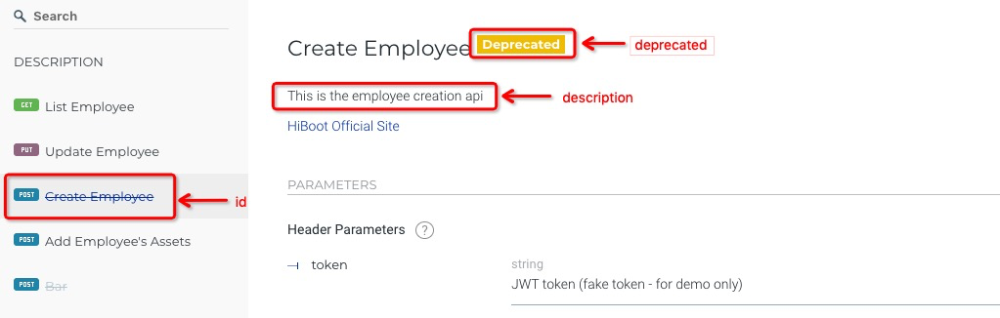
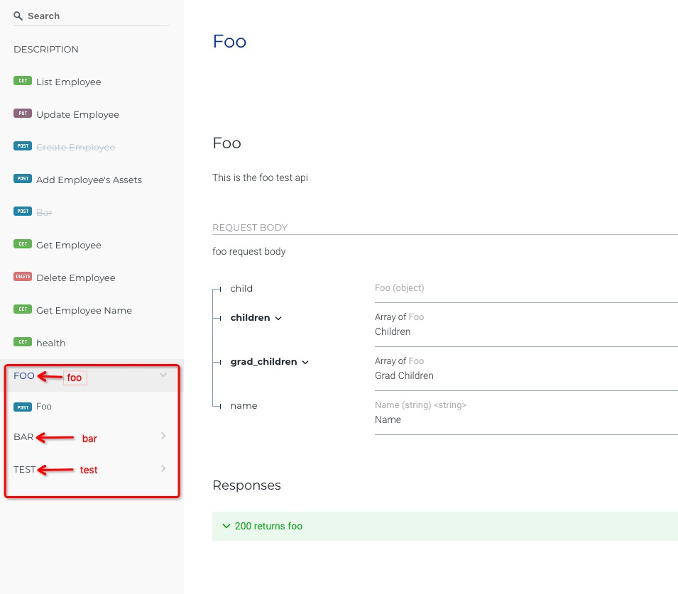
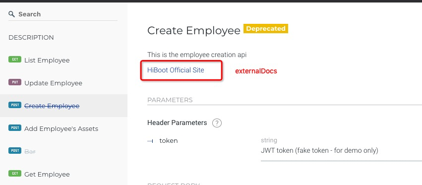
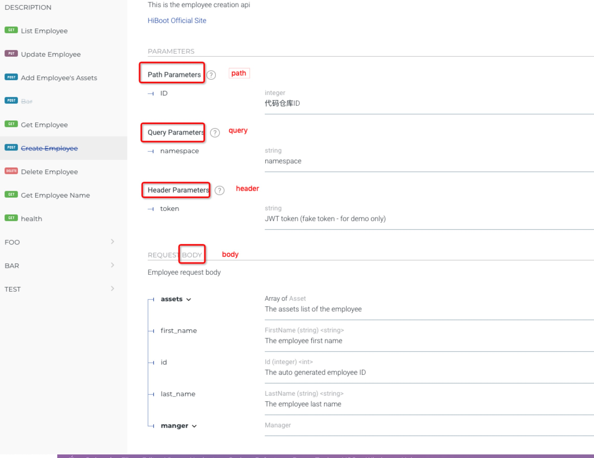
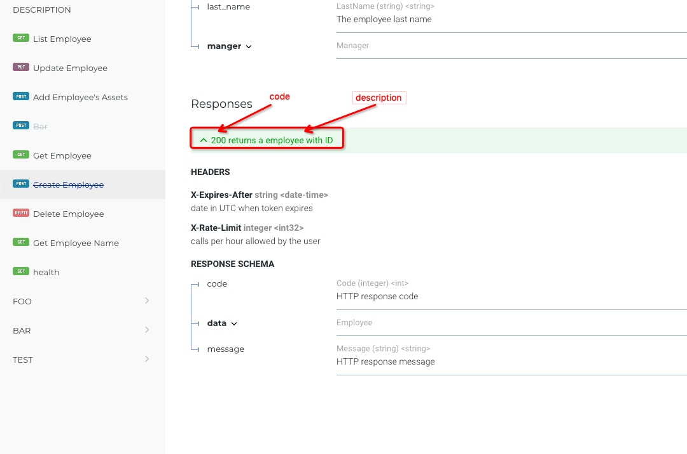
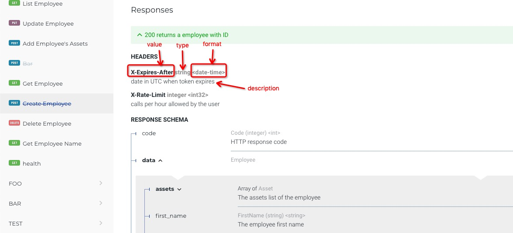

Hiboot开发接口文档采用OpenAPI标准Swagger2.0, 使用简单几个注解即可完成RESTFul风格接口文档的编写, 当Hiboot应用运行时,接口文档将自动提供在线GUI文档, 如 `http://hiboot-app.your-domain.com/swagger-ui`

## Operation

operation注解定义:

```go
type Operation struct {
	Annotation
	Swagger
	AtID string `at:"id" json:"-"`
	AtDescription string `at:"description" json:"-"`
	AtDeprecated bool `at:"deprecated" json:"-"`
}
```

操作用于描述一个API文档,如图所示,
id用于显示api在文档中的问题,
description用于描述api的作用
deprecated为true的时候,显示Deprecated的黄色标记

```go
func (c *) CreateEmployee(at struct{
     at.PostMapping `value:"/"`
     at.Operation   `id:"Create Employee" description:"This is the employee creation api" deprecated:"true"`
   }, request EmployeeRequest) {
}
```



## Tags

tags注解定义:

```go
type Tags struct {
	Annotation
	Swagger
	AtValues []string `at:"values" json:"-"`
}
```

Tags用于定义api分组

```go
func (c *employeeController) Foo(at struct {
	at.PostMapping `value:"/foo"`
	at.Operation   `id:"Foo" description:"This is the foo test api"`
	at.Consumes    `values:"application/json"`
	at.Produces    `values:"application/json"`
	at.Tags        `values:"foo,bar,test"`
},request *Foo)
```

values定义分组,使用逗号分隔,一个api可以定义多个tag标记


## ExternalDocs

ExternalDocs注解定义:

```go
type ExternalDocs struct {
	Annotation
	Swagger
	AtDescription string `at:"description" json:"-"`
	AtURL         string `at:"url" json:"-"`
}
```

url用于定义url跳转的地址,description用于描述url在文档中的描述

```go
func (c *employeeController) CreateEmployee(at struct {
	at.PostMapping  `value:"/"`
	at.Operation    `id:"Create Employee" description:"This is the employee creation api" deprecated:"true"`
	at.Consumes     `values:"application/json"`
	at.Produces     `values:"application/json"`
	at.ExternalDocs `url:"http://hiboot.hidevops.io" description:"HiBoot Official Site"`
})
```



## Parameter

Parameter注解定义:

```go
type Parameter struct {
	Annotation
	Swagger
	AtName string `at:"name" json:"-"`
	AtType string `at:"type" json:"-"`
	AtIn string `at:"in" json:"-"`
	AtDescription string `at:"description" json:"-"`
}
```

name用于描述api中定义的字段,description描述字段在api文档的显示,
type描述字段的类型,in有4中类型:
header描述在http header中定义的字段,
body描述在http body中定义的字段,
query描述在http路径中定义的key-value对,
path描述在路径中定义的字段,
如下图所示

```go
func (c *employeeController) CretateEmployee(at struct {
	at.PostMapping  `value:"/{id}"`
	at.ExternalDocs `url:"http://hiboot.hidevops.io" description:"HiBoot Official Site"`
	Parameters      struct {
		Token struct {
			at.Parameter `name:"token" in:"header" type:"string" description:"JWT token (fake token - for demo only)"`
		}
		Body struct {
			at.Parameter `name:"employee" in:"body" description:"Employee request body" `
			CreateEmployeeRequest
		}
		Namespace struct {
			at.Parameter `name:"namespace" type:"string" in:"query" description:"namespace"`
		}
		ID struct {
			at.Parameter `name:"ID" type:"integer" in:"path" description:"代码仓库ID"`
		}
	}
})
```



## Produces

Produces注解定义:

```go
type Produces struct{
	Annotation
	Swagger
	AtValues []string `at:"values" json:"-"`
}
```

Produces用于定义request中Content-Type字段可以使用的类型,
values可以定义多个值,使用逗号分隔

```go
func (c *employeeController) CreateEmployee(at struct {
	at.PostMapping  `value:"/{id}"`
	at.Operation    `id:"Create Employee" description:"This is the employee creation api" deprecated:"true"`
	at.Consumes     `values:"application/json"`
	at.Produces     `values:"application/json"`
})
```


## Consumes

Consumes注解定义:

```go
type Consumes struct{
	Annotation
	Swagger
	AtValues []string `at:"values" json:"-"`
}
```

Produces用于定义response中Content-Type字段可以使用的类型,
values可以定义多个值,使用逗号分隔

```go
func (c *employeeController) CreateEmployee(at struct {
	at.PostMapping  `value:"/{id}"`
	at.Operation    `id:"Create Employee" description:"This is the employee creation api" deprecated:"true"`
	at.Consumes     `values:"application/json"`
	at.Produces     `values:"application/json"`
})
```

## Response

Response注解定义:

```go
type Response struct {
	Annotation
	Swagger
	AtCode int `at:"code" json:"-"`
	AtDescription string `at:"description" json:"-"`
}
```

code定义http返回码,
description描述code的作用

```go
func (c *employeeController) CreateEmployee(at struct {
	at.PostMapping  `value:"/{id}"`
	at.Operation    `id:"Create Employee" description:"This is the employee creation api" deprecated:"true"`
	Responses struct {
		StatusOK struct {
			at.Response `code:"200" description:"returns a employee with ID"`
			XRateLimit  struct {
				at.Header `value:"X-Rate-Limit" type:"integer" format:"int32" description:"calls per hour allowed by the user"`
			}
			XExpiresAfter struct {
				at.Header `value:"X-Expires-After" type:"string" format:"date-time" description:"date in UTC when token expires"`
			}
			EmployeeResponse
		}
	}
}
```



## Header

Header注解定义:

```go
type Header struct{
	Annotation
	Swagger
	AtType string `at:"type" json:"-"`
	AtFormat string `at:"format" json:"-"`
	AtDescription string `at:"description" json:"-"`
}
```

value定义header字段,
type定义header字段的类型,
format定义header字段格式,
description用于描述header字段在文档的说明

```go
func (c *employeeController) CreateEmployee(at struct {
	at.PostMapping  `value:"/{id}"`
	at.Operation    `id:"Create Employee" description:"This is the employee creation api" deprecated:"true"`
	Responses struct {
		StatusOK struct {
			at.Response `code:"200" description:"returns a employee with ID"`
			XRateLimit  struct {
				at.Header `value:"X-Rate-Limit" type:"integer" format:"int32" description:"calls per hour allowed by the user"`
			}
			XExpiresAfter struct {
				at.Header `value:"X-Expires-After" type:"string" format:"date-time" description:"date in UTC when token expires"`
			}
			EmployeeResponse
		}
	}
}
```


